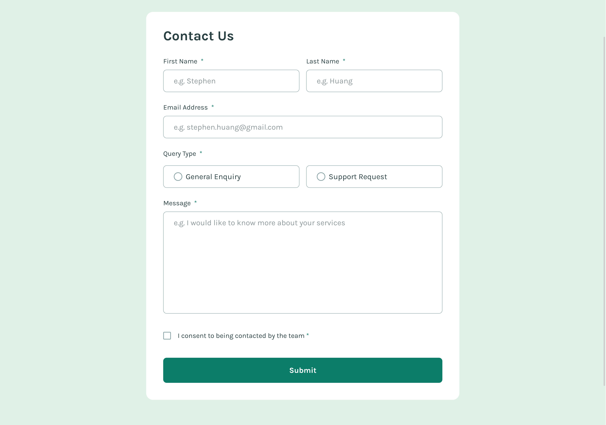

# Frontend Mentor - Contact form solution

This is a solution to the [Contact form challenge on Frontend Mentor](https://www.frontendmentor.io/challenges/contact-form--G-hYlqKJj). Frontend Mentor challenges help you improve your coding skills by building realistic projects. 

## Table of contents

- [Overview](#overview)
  - [The challenge](#the-challenge)
  - [Screenshot](#screenshot)
  - [Links](#links)
- [My process](#my-process)
  - [Built with](#built-with)
  - [What I learned](#what-i-learned)
  - [Continued development](#continued-development)
- [Author](#author)

**Note: Delete this note and update the table of contents based on what sections you keep.**

## Overview

### The challenge

Users should be able to:

- Complete the form and see a success toast message upon successful submission
- Receive form validation messages if:
  - A required field has been missed
  - The email address is not formatted correctly
- Complete the form only using their keyboard
- Have inputs, error messages, and the success message announced on their screen reader
- View the optimal layout for the interface depending on their device's screen size
- See hover and focus states for all interactive elements on the page

### Screenshot



### Links

- Solution URL: [GitHub Link](https://github.com/Achigyus/contact-form-main)
- Live Site URL: [Live Site](https://contact-form-achigyus.netlify.app/)

## My process

### Built with

- Semantic HTML5 markup
- SASS
- Flexbox
- Mobile-first workflow
- TypeScript
- [Vite](https://vite.dev/) - The Build Tool for the Web

### What I learned

I learned how to setup a typescript project in vite and also how to use sass to write less css code through rule nesting

Some code I'm proud of:

```css
.query_wrap
  border: 1px solid vars.$gray_500
  border-radius: vars.$spacing_1
  padding: 0.75rem 1.5rem
  font-size: 1.125rem
  line-height: 1.5
  color: vars.$gray_900
  display: flex
  gap: 0.75rem
  align-items: center
  flex: 1 1 0%

  &:hover
    border: 1px solid vars.$green_600

  label
    font-size: 1.125rem
    line-height: 1.5
    color: vars.$gray_900
    cursor: pointer

  &:has(input[type="radio"]:checked), &:has(.querytype_input:focus-visible)
    background-color: vars.$green_200
    border: 1px solid vars.$green_600
```

```js
window.scroll({
  top: 0, 
  left: 0, 
  behavior: 'smooth'
})
```

### Continued development

Continued development on Typescript and accessibility 

## Author

- Website - [Achigyus](https://github.com/Achigyus)
- Frontend Mentor - [@Achigyus](https://www.frontendmentor.io/profile/Achigyus)